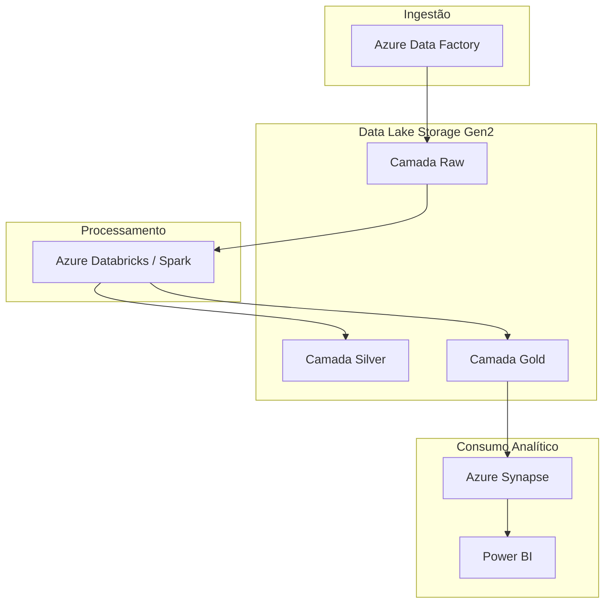

# Projeto Azure ETL - Cafés Urbanos

Este projeto demonstra um fluxo completo de **ETL** voltado para o ambiente
Azure utilizando um conjunto de dados fictício de uma rede de cafeterias.
O objetivo é apresentar boas práticas de organização em *data lakehouse*,
modelagem dimensional (Star Schema) e integrações com serviços Azure.

## Visão Geral da Arquitetura

O projeto foi estruturado considerando os principais blocos da plataforma de
dados moderna na Azure:

1. **Azure Data Factory** – Orquestração de pipelines para ingestão e
   agendamento do ETL (arquivo exemplo em `infrastructure/data_factory_pipeline.json`).
2. **Azure Data Lake Storage Gen2** – Armazenamento por camadas (*raw*,
   *staging/silver* e *curated/gold*), refletido na estrutura de pastas
   `data/` e `output/`.
3. **Azure Databricks** (ou Synapse Spark) – Camada de transformação
   processando dados com notebooks Spark ou jobs Python (exemplo local em
   `etl/pipeline.py`).
4. **Azure Synapse Analytics** – Camada de consumo, com scripts DDL para
   criação das tabelas dimensionais e fato em `infrastructure/synapse_ddl.sql`.
5. **Power BI / Azure Analysis Services** – Consumo analítico sobre a zona
   gold (não incluso, mas previsto no desenho).



## Estrutura de Pastas

```
azure_etl_project/
├── data/
│   ├── raw/              # Ingestão (Bronze)
│   └── reference/        # Tabelas de apoio
├── docs/                 # Documentação e diagramas
├── etl/                  # Scripts de transformação
├── infrastructure/       # Artefatos Azure (ADF, Synapse)
└── output/
    ├── staging/          # Zona intermediária (Silver)
    └── curated/          # Tabelas dimensionais e fato (Gold)
```

## Dados Mockados

Os dados de exemplo localizam-se em `data/raw` e representam:

- **customers**: informações de clientes e níveis de fidelidade.
- **products**: mix de produtos com categorias e custos unitários.
- **stores**: unidades físicas e quiosques por região.
- **sales**: vendas omnichannel (loja física e delivery) com descontos.

Uma tabela de calendário em `data/reference/calendar.csv` complementa o modelo.

## Pipeline Local

O pipeline foi implementado em Python com `pandas` para facilitar a execução
local e espelhar o que seria um job Databricks. Para executar:

```bash
pip install -r requirements.txt  # instala pandas, pytest e dependências
python etl/pipeline.py
```

A execução gera os arquivos `dim_*.csv` e `fact_sales.csv` na pasta
`output/curated`, mantendo o modelo dimensional descrito em `docs/star_schema.md`.
Antes de salvar as tabelas, o script dispara verificações de Data Quality
(`etl/quality_checks.py`) garantindo chaves únicas e integridade
referencial do star schema.

Para validar tudo automaticamente, rode os testes de QA:

```bash
pytest
```

## Modelagem Dimensional

O modelo segue um Star Schema com as seguintes tabelas:

- `dim_customer`
- `dim_product`
- `dim_store`
- `dim_date`
- `fact_sales`

Detalhes de cada atributo estão documentados em `docs/star_schema.md`, junto a
um diagrama Mermaid. Scripts DDL para implantação em Synapse estão disponíveis
em `infrastructure/synapse_ddl.sql`.

## Próximos Passos Recomendados

1. Publicar o pipeline no Azure Data Factory utilizando Integration Runtime
   Self-hosted ou Azure IR.
2. Versionar os notebooks Databricks conectados a este repositório via
   Git Integration.
3. Habilitar camadas Delta Lake/Parquet para otimizar o consumo analítico.
4. Provisionar um workspace do Power BI conectado ao Synapse para dashboards
   de vendas omnichannel.

## Requisitos

- Python 3.10+
- pandas >= 1.5
- (Opcional) pyarrow para escrita Parquet ao evoluir o projeto.

## Licença

Projeto educacional distribuído sob licença MIT.
