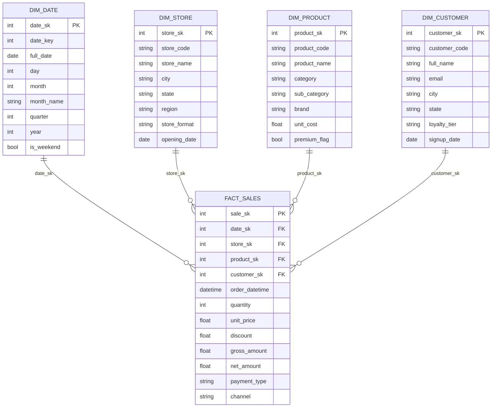

# Star Schema - Cafés Urbanos

## Dicionário de Dados

### Fato `fact_sales`
- `sale_sk`: chave substituta da venda.
- `date_sk`, `store_sk`, `product_sk`, `customer_sk`: chaves estrangeiras para
  as dimensões relacionadas.
- `order_datetime`: data e hora completas da transação.
- `quantity`: quantidade de itens vendidos.
- `unit_price`: preço unitário praticado para o item na venda.
- `discount`: valor absoluto de desconto aplicado à linha de venda.
- `gross_amount`: valor bruto da venda (`quantity * unit_price`).
- `net_amount`: valor líquido (`gross_amount - discount`).
- `payment_type`: meio de pagamento utilizado.
- `channel`: canal de atendimento (loja física, delivery, etc.).

### Dimensão `dim_date`
- `date_sk`: chave substituta.
- `date_key`: chave natural formatada como `yyyymmdd`.
- `full_date`: data completa.
- `day`: dia do mês.
- `month`: número do mês.
- `month_name`: nome do mês (locale PT-BR).
- `quarter`: trimestre fiscal.
- `year`: ano.
- `is_weekend`: indicador binário de fim de semana.

### Dimensão `dim_store`
- `store_sk`: chave substituta.
- `store_code`: código natural da loja.
- `store_name`: nome fantasia.
- `city`: cidade.
- `state`: unidade federativa.
- `region`: macro região brasileira.
- `store_format`: formato comercial (flagship, quiosque, etc.).
- `opening_date`: data de abertura.

### Dimensão `dim_product`
- `product_sk`: chave substituta.
- `product_code`: SKU natural.
- `product_name`: nome do produto.
- `category`: categoria principal.
- `sub_category`: subcategoria.
- `brand`: marca.
- `unit_cost`: custo unitário (base para margem).
- `premium_flag`: indicador se o produto é premium (custo >= 9).

### Dimensão `dim_customer`
- `customer_sk`: chave substituta.
- `customer_code`: identificador natural.
- `full_name`: nome completo.
- `email`: email do cliente.
- `city`: cidade de residência.
- `state`: unidade federativa.
- `loyalty_tier`: nível no programa de fidelidade.
- `signup_date`: data de cadastro.

## Considerações de Azure Synapse

- As tabelas dimensionais podem ser distribuídas via `REPLICATE` para otimizar
  *joins* no Dedicated SQL Pool.
- A tabela fato deve ser distribuída por `HASH(store_sk)` ou `HASH(date_sk)`
  conforme principais consultas.
- Habilite *materialized views* para agregações recorrentes (ex.: vendas por
  dia e canal).
